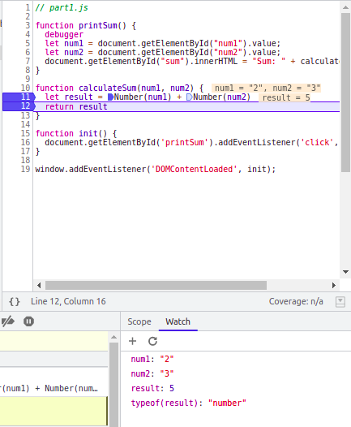

# Devtools - Debugging
### 1
The bug was that the inputs for `num1` and `num2` were not type casted and were
read as strings. Therefore, when calculating the sum, it was just string 
concatenation instead of integer arithmetic.

### 2
I would fix this bug by explicitly type casting both variables to be a number.
